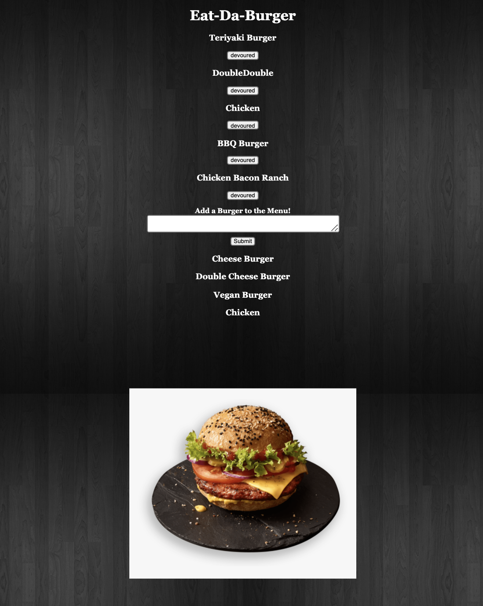

# Burger-logger

This application shows a list or menu of burgers that can be devoured.

## Description

* The application was created using a local server and the deployed version was created with Heroku.

* When you add a burger to the text field and click submit, it becomes added to the menu and is ready to be devoured.

* When you click the devour button, the burger is added to the bottom of the page where the devoured burgers are stored.

* The burgers are stored in the mySQL database, the devoured burgers are given a boolean value of true.

## Link

https://github.com/nickgusd/burger-logger.git

## Screenshot of application

